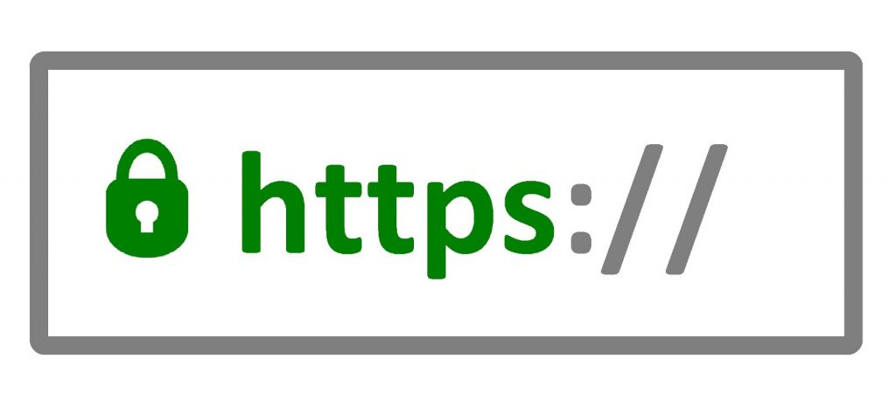
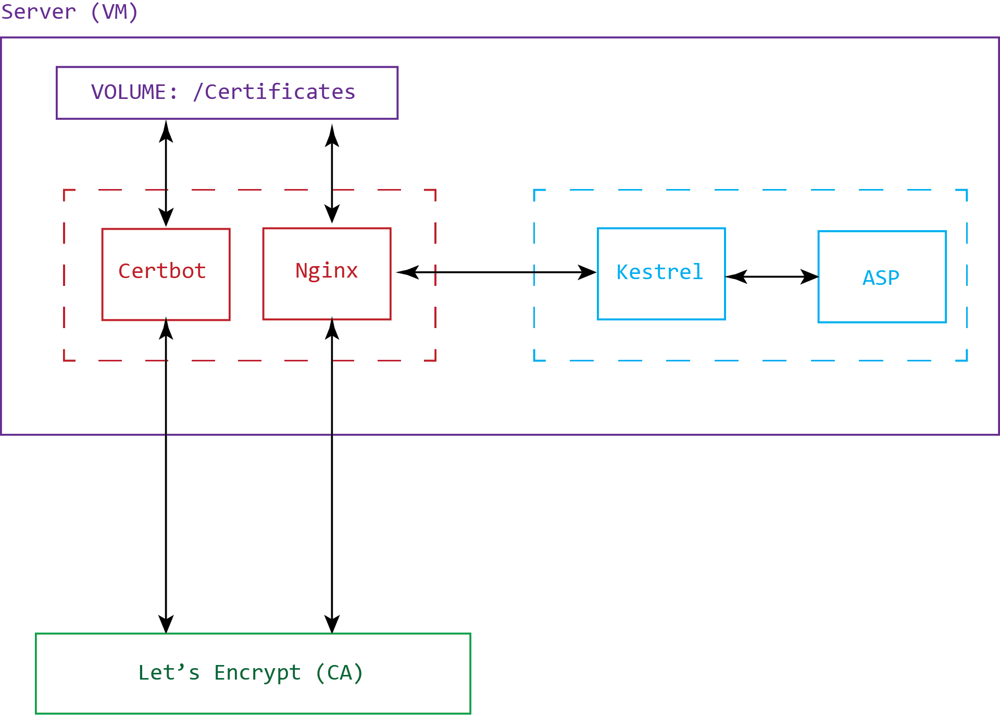

<link rel="stylesheet" href="style.css" />

<!-- Front Page -->
<div class="slide">

# Automate Certificate Renewal Using CertBot

<div>



</div>

<div class="footer">
    <b>Soheil Vaseghi</b> | Senior Consultant @ Telstra Purple
</div>

</div>

<!-- ----------------------------------------------------------------- -->
<!-- What is HTTPS -->
<div class="slide">

# HTTPS

- HTTP + TLS (formerly SSL)
- Asymmetric Encryption
- Private Key => Web Server
- Public Key => Everyone who wants to interact with the server
- Expiry Date
  
</div>

<!-- ----------------------------------------------------------------- -->
<!-- Agenda -->
<div class="slide">

# Agenda

1. Create ASP.NET Core App
2. Setup a Reverse Proxy
3. Automate Certificate Retrieval
4. Live Demo
  
</div>

<!-- ----------------------------------------------------------------- -->
<!-- Create .NET Project -->
<div class="slide">

# Create ASP.NET Project

1. Create ASP.NET application

<div class="code">

`dotnet new webapp -o webapp`
</div>

2. Trust the Development Certificate


<div class="code">

`dotnet dev-certs https --trust`
</div>

3. Run the App


<div class="code">

`cd webapp && dotnet watch run`
</div>


</div>


<!-- ----------------------------------------------------------------- -->
<!-- v1-app -->
<div class="slide">

# Demo App Running

<div class="code">

`git checkout v1-app`
</div>

</div>


<!-- ----------------------------------------------------------------- -->
<!-- Kestrel -->
<div class="slide">

# Kestrel - Lightweight Cross-platrofrm Web Server


### Edge:

<div class="full-image">


</div>

### Reverse Proxy:

<div class="full-image">


</div>


</div>

<!-- ----------------------------------------------------------------- -->
<!-- NGINX -->
<div class="slide">

# Nginx

<div class="code">

`mkdir nginx && touch nginx/Dokcerfile`
</div>

```
FROM nginx
```

<div class="code">

`touch docker-compose.yml`
</div>

```
version: "3.8"

services:
  nginx:
    build:
      context: ./nginx
      dockerfile: Dockerfile
    ports:
      - "8080:80"
    container_name: nginx
    restart: always
```

<div class="code">

`docker-compose up`
</div>


</div>

<!-- ----------------------------------------------------------------- -->
<!-- v2-nginx -->
<div class="slide">

# Demo Nginx

<div class="code">

`git checkout v2-nginx`
</div>

</div>

<!-- ----------------------------------------------------------------- -->
<!-- Web App Dockerfile -->
<div class="slide">

# Web App Dockerfile

<div class="code">

`touch webapp/Dokcerfile`
</div>

```
FROM mcr.microsoft.com/dotnet/sdk:5.0 AS build
WORKDIR /app

# Copy csproj and restore as distinct layers
COPY *.csproj .
RUN dotnet restore

# Copy everything else and build
COPY . .
RUN dotnet publish -c Release -o out --self-contained --runtime linux-x64

# Build runtime image
FROM mcr.microsoft.com/dotnet/runtime:5.0
WORKDIR /app
COPY --from=build /app/out .

ENV ASPNETCORE_URLS http://*:5000
ENTRYPOINT ["dotnet", "webapp.dll"]
```

</div>

<!-- ----------------------------------------------------------------- -->
<!-- Web App Docker Compose -->
<div class="slide">

# Web App Docker Compose

<div class="code">

`vi docker-compose.yml`
</div>

```
...
  web:
    build:
      context: ./webapp
      dockerfile: Dockerfile
    ports:
      - "5000:5000"
    expose:
      - "5000"
    depends_on:
      - nginx
    container_name: kestrel
```

<div class="code">

`docker-compose up --build`
</div>

</div>


<!-- ----------------------------------------------------------------- -->
<!-- v3-app-in-docker -->
<div class="slide">

# Demo Web App in Docker

<div class="code">

`git checkout v3-app-in-docker`
</div>

</div>


<!-- ----------------------------------------------------------------- -->
<!-- Configure Reverse Proxy -->
<div class="slide">

# Configure Reverse Proxy

<div class="code">

`touch nginx/nginx.conf`
</div>

```
events {
    worker_connections 1024;
}

http {
    upstream website {
        server web:5000;
    }

    server {
        listen 80;
        listen [::]:80;

        location / {
            proxy_pass http://website;
            proxy_redirect off;
            proxy_http_version 1.1;
        }
    }
}
```
</div>


<!-- ----------------------------------------------------------------- -->
<!-- Configure Reverse Proxy (Cont.) -->
<div class="slide">

# Configure Reverse Proxy (Cont.)

<div class="code">

`vi nginx/Dockerfile`
</div>

```
FROM nginx

COPY ./nginx.conf /etc/nginx/nginx.conf
```

</div>

<!-- ----------------------------------------------------------------- -->
<!-- v4-reverse-proxy -->
<div class="slide">

# Demo Reverse Proxy

<div class="code">

`git checkout v4-reverse-proxy`
</div>

</div>

<!-- ----------------------------------------------------------------- -->
<!-- Certbot & Let's Encrypt -->
<div class="slide">

# Let's Encrypt and Certbot
- Nonprofitable Certificate Authority
- Automatic Certificate Management Environment (ACME) Protocol
- Certbot is one of the many ACME clients
- Verify Domain ownership:
  - DNS Record
  - HTTP resource under `well-known` URI
- CA validates the challenges
- Compatible with most modern browsers
- 90 Days expiry
  - Limit key compromise damage
  - Encourage automation
- Rate limits:
  - 50 Certificates per Domain per week
  - 5 Renewal per week
</div>


<!-- Front Page -->
<div class="slide">

# Diagram

<div>



</div>

</div>


<!-- ----------------------------------------------------------------- -->
<!-- Install Certbot -->
<div class="slide">

# Install Certbot in the Container
<div class="code">

`vi nginx/Dockerfile`
</div>

```
...
RUN ["apt-get", "update"]
RUN ["apt-get", "install", "-y", "certbot"]
...

COPY ./entrypoint.sh /entrypoint.sh

ENTRYPOINT [ "sh", "/entrypoint.sh" ]
```

### Certbot should execute via ENTRYPOINT not RUN or CMD.
</div>

<!-- ----------------------------------------------------------------- -->
<!-- Entrypoint -->
<div class="slide">

# Container Entrypoint

<div class="code">

`touch nginx/entrypoint.sh`
</div>

```
#!/bin/bash

certificate_path="/etc/letsencrypt/live/soheilvaseghi.com"
if [ -d "$certificate_path" ]; then
  fullchain_path=$certificate_path/fullchain.pem
  # 108000 = 30 * 3600 => 30 Days
  if ! openssl x509 -checkend 108000 -noout -in $fullchain_path; then
    certbot certonly \
    --standalone \
    --preferred-challenges http \
    --email vaseghi.soheil@gmail.com \
    --non-interactive \
    -d soheilvaseghi.com \
    --rsa-key-size 4096 \
    --agree-tos
  fi
else
  certbot certonly \
  --standalone \
  --preferred-challenges http \
  --email vaseghi.soheil@gmail.com \
  --non-interactive \
  -d soheilvaseghi.com \
  --rsa-key-size 4096 \
  --agree-tos
fi

nginx
```

</div>


<!-- ----------------------------------------------------------------- -->
<!-- Nginx HTTPS -->
<div class="slide">

# Nginx HTTPS

<div class="code">

`vi nginx/nginx.conf`
</div>

```
daemon off;
...
http {
    server {
        listen 80;
        listen [::]:80;

        location /.well-known/acme-challenge/ {
            root /var/www/certbot;
        }

        location / {
            return 301 https://$host$request_uri;
        }
    }

    server {
        listen 443 ssl http2;
        listen [::]:443 ssl http2;

        ssl_certificate /etc/letsencrypt/live/soheilvaseghi.com/fullchain.pem;
        ssl_certificate_key /etc/letsencrypt/live/soheilvaseghi.com/privkey.pem;

        location / {
            proxy_pass http://website;
            proxy_redirect off;
            proxy_http_version 1.1;
        }
    }
}

```

</div>

<!-- ----------------------------------------------------------------- -->
<!-- Container Volume Mapping -->
<div class="slide">

# Container Volume

<div class="code">

`vi docker-compose.yml`
</div>

```
services:
  nginx:
    ...
    volumes:
      - /soheil/certificate:/etc/letsencrypt
      - /soheil/www:/var/www/certbot
    ...
```

### Because we don't want to lose certificates every time container stops.
</div>

<!-- ----------------------------------------------------------------- -->
<!-- v5-certbot -->
<div class="slide">

# Demo Certbot

<div class="code">

`git checkout v5-certbot`
</div>

</div>


<!-- ----------------------------------------------------------------- -->
<!-- CRON -->
<div class="slide">

# Schedule Automatic Renew using cron

<div class="code">

`touch /etc/cron.d/<your_file>`
</div>

```
* * * * * <command to execute>
```

### 1st * = minute (0-59)
### 2nd * = hour (0-23)
### 3rd * = day of the month (1-31)
### 4th * = month (1-12)
### 5th * = day of the week (0-6)


## Run Every 24 Hours at Mid-night
```
* 0 * * * root certbot...
```

</div>

<!-- ----------------------------------------------------------------- -->
<!-- CRON -->
<div class="slide">

# Add Cron Job to the Container
<div class="code">

`vi nginx/Dockerfile`
</div>

```
...
RUN ["apt-get", "install", "-y", "cron"]

COPY ./renew /etc/cron.d/renew
RUN chmod 0644 /etc/cron.d/renew
...
```

<div class="code">

`vi nginx/entrypoint.sh`
</div>

```
...
cron
nginx
```

<div class="code">

`touch nginx/renew`
</div>

```
* 0 * * * root certbot certonly --webroot --webroot-path /var/www/certbot --email vaseghi.soheil@gmail.com --non-interactive -d soheilvaseghi.com --rsa-key-size 4096 --agree-tos
* 0 * * * root nginx -s reload

```
</div>

<!-- ----------------------------------------------------------------- -->
<!-- v6-cron -->
<div class="slide">

# Demo Cron

<div class="code">

`git checkout v6-cron`
</div>

</div>

<!-- ----------------------------------------------------------------- -->
<!-- Live Demo -->
<div class="slide">

# Live Demo
<div class="code">

`ssh soheilvaseghi.com`
</div>

</div>